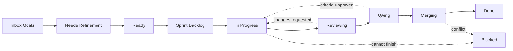
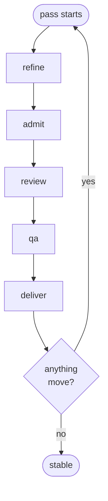

# Running the Crew

As of 2026-09-22.

An operator's guide to the crew, and an honest read on how close it is to a full agile organisation.

## What the crew is

An agile organisation run as agents, where the GitHub Projects board is the orchestrator rather than a report of one. A card's column is not a status someone updates — it is the queue a phase reads from, and moving it is how work is handed on.

Seven roles, each an agent with its own prompt, model alias and capability allow-list. One human: the Sponsor, who writes goals, approves epics, and reviews at sprint end.

| Piece | What it is |
| --- | --- |
| **Board** | GitHub Projects v2, organization-owned — a fine-grained token cannot reach a user-owned Projects board |
| **Issues and PRs** | Two GitHub Apps: one delivers, one reviews. GitHub refuses an approval from the identity that opened the pull request |
| **Model** | Qwen3.8-27B under SGLang on a DGX Spark, fronted by LiteLLM, 262,144-token window |
| **Escalation** | Headless Claude Code on a subscription — deliberately no Anthropic entry in the proxy config, so no misconfiguration can produce a metered bill |
| **Sandbox** | Generated code runs in a container with no network and no capabilities. `required` by default: no engine means the run fails rather than falling back to the host |

Two repositories are in play. `crew` is the orchestrator itself and is deliberately **not** in `delivery.repos` — an orchestrator editing itself mid-run breaks the thing making the change. `sprint-metrics` is the pilot the crew actually builds.

## The board

**Columns are queues.** A column names what a card is *waiting for*, never what is being done to it. A card sits in one for the whole of that phase's work and leaves when the phase is finished with it — so a card in QAing may be waiting for QA or being verified by it, and the board does not distinguish.



Solid arrows are the path. Dotted arrows are the ways back: a card returns to In Progress when either gate refuses it, and reaches Blocked from anywhere when only a person can move it.

| Column | Waiting for | Drained by | WIP |
| --- | --- | --- | --- |
| Inbox (Goals) | The Sponsor to approve or reject | a person | — |
| Needs Refinement | The Business Analyst to split it | refine | 8 |
| Ready | A sprint to admit it | admit | 10 |
| Sprint Backlog | A Developer to claim it | deliver | 10 |
| In Progress | The Developer to finish | deliver | 3 |
| Reviewing | The Code Reviewer to judge the diff | review | 3 |
| QAing | QA to verify behaviour against the criteria | qa | 3 |
| Merging | The merge — it is verified and approved | deliver | 3 |
| Blocked | A person | a person | — |

WIP limits are deterministic rules in `crew_org.process`, not an agent's judgement. A limit an agent can decide to ignore is not a limit.

Two human gates and no more: an epic awaiting approval in Inbox (Goals), and the sprint review at `crew sprint close`. Admission to a sprint is **not** a gate — approving the epic was the scope decision, so filling the sprint from approved epics is arithmetic.

## A tick

`crew tick` runs five phases in dependency order until a pass moves nothing. One command takes the board as far as it can go.



**Drain-first.** Work already started is pushed forward before new work is claimed, so a story never branches from a default branch missing its predecessors.

| Phase | Reads | Does | Writes |
| --- | --- | --- | --- |
| refine | Inbox (Goals), Needs Refinement | Product Owner proposes epics; Business Analyst splits approved epics into stories | new issues, cards to Inbox and Ready |
| admit | Ready | Fills the sprint from approved epics in priority order until capacity | cards to Sprint Backlog |
| review | open pull requests | Code Reviewer judges each diff | a GitHub review; cards to QAing or back to In Progress |
| qa | QAing | Verifies behaviour against each acceptance criterion | a verdict comment; cards to Merging or back to In Progress |
| deliver | Merging, then Sprint Backlog | Merges what is approved, then claims and implements the next story | merges, branches, pull requests |

**A failing phase does not end the pass.** Later phases act on the cards they can, and the failure is reported beside what did happen — a tick that aborts on the first error leaves the board partway through a state nobody chose.

**Quiescence is bounded.** Five passes maximum. A pass that keeps moving forever is a bug, not a busy board, and hitting the cap is reported as *stopped*, never as stable.

## The roles

| Role | Produces | May escalate |
| --- | --- | --- |
| Product Sponsor (human) | Goals; epic approval; sprint acceptance | — |
| Product Owner | Epics | No |
| Business Analyst | Stories, tasks, acceptance criteria, estimates | No |
| Architect | Design notes, tasks, spikes | Yes |
| Developer | Code, tests, docs, pull requests, bugs | Yes |
| QA Engineer | Behaviour verdicts, bugs | No |
| Code Reviewer | Diff verdicts, bugs | Yes |
| Scrum Master | Standups, retros, process defects | No |

Roles live in `config/agents.yaml` as data — goal, backstory, model alias, capability allow-list, and the constitution sections injected into the prompt. Changing how a role behaves is a config change reviewed like any other, not a prompt edited in passing.

**What is enforced rather than asked for.** A boundary that depends on granularity (goal vs epic vs story) or altitude (what vs how) is exactly what a small model blurs, so it is made structural:

- **Capability allow-lists.** A Product Owner *cannot* write acceptance criteria; a Business Analyst *cannot* redraw an epic.
- **Contract preservation.** `broken_contracts` refuses a public signature change that would break merged callers. Bodies and private helpers are free. The prompt asked for this first and the model did it anyway on the first attempt — a prompt is a request, this is a guarantee.
- **Whole-file rewrites.** A "new file" that already exists is refused. Deleted tests do not fail; they stop existing.
- **WIP limits and card movement.** Deterministic, in `crew_org.process`.
- **One story at a time per epic.** Siblings extend each other, so delivery holds a story until its earlier sibling has landed.

**And the counterweight.** Before adding a rule, ask whether the agent was *shown* what it needed to follow the rule it already had. Every context defect found on 2026-09-19 was prose compensating for something an agent could not see. The Developer, QA, the Reviewer, the Product Owner and the Business Analyst all now read the whole repository — the pilot is 3% of the window, the crew itself 40% (re-measured 2026-09-22).

## Running it

Start here, in this order. The first two change nothing.

```
uv run crew doctor                                    # through the proxy: is the model serving, and can it call tools
uv run crew auth                                      # are both identities correctly scoped
uv run crew tick                                      # the whole loop, and it lands what it produces
```

| Command | Changes | Notes |
| --- | --- | --- |
| `crew doctor` | nothing | Probes through the LiteLLM proxy (`CREW_LLM_BASE_URL`, with its key) as `crew-local`, the path every tick takes. Checks the endpoint, chat, tool calling, constrained JSON, context length and thinking control. `--deep` adds a CrewAI round trip |
| `crew auth` | nothing | Verifies the delivery identity's scope and that the reviewing identity is a different one. See the note below |
| `crew tick` | the board, GitHub | Refines, admits, reviews, verifies, opens pull requests and merges approved ones. Ends with a standup on the sprint's `standup` issue |
| `crew tick --demo` | nothing | Renders the live view from synthetic events. No model needed |
| `crew tick --passes N` | — | Caps the passes. Useful the first time you run it against a changed board |
| `crew deliver`, `review`, `qa` | the board, GitHub | The individual phases, still available |
| `crew sprint start --dry-run` | nothing | Shows what would be admitted and why |
| `crew sprint close` | the board, GitHub | The sprint review. A human gate. Records the retro as an issue, once per sprint |
| `crew moves [--people]` | nothing | Every card movement on the board and who made it: the crew, the platform (`board.yml`), or a person, named. Read from GitHub's own history |
| `crew revert <pr> --reason "…"` | GitHub | Opens a pull request undoing a merged one. It lands through review and `deliver` like any change |
| `crew onboard <repo> [--from <file>] [--terminal]` | GitHub | The Product Owner interviews you about a project, in a local page (or the terminal), and proposes its record, `.crew/project.yaml`, as a pull request to that project. See below |

**It lands what it produces.** There is no dry mode. A rehearsal cost the same inference as the real thing, left nothing that could land, wrote no event log at all, and put cards back where it found them — which was three of the five backward moves in the crew's own log, and noise `crew capability` had to filter out of the crew's self-knowledge.

What made landing frightening was having no way to undo it. The answer is a revert (crew#83), not a rehearsal. `crew sprint start --dry-run` stays: it shows what would be admitted and costs nothing.

**Undoing a change.** `crew revert <pr> --reason "…"` opens a pull request on a `revert/<pr>-…` branch. It is reviewed like any other change, and the deliver phase merges it once approved. When it lands, whoever merged it, the card whose work it undid is reopened and returned to Needs Refinement with `needs:human`, because the work is not done. A revert that does not apply cleanly is never forced: the card is blocked with the conflicting paths named. Each step is a `revert.*` event recording the pull request reverted, its card and the reason.

**Two identities.** The delivery app opens pull requests; the reviewing app judges them. GitHub refuses an approval from the identity that opened the pull request, so one app could only ever comment on the crew's own work and every story stalled waiting for a person.

> **Resolved, verified 2026-09-22.** The reviewing app's approvals count, and
> the crew merges its own work end to end. sprint-metrics PR #66 was approved by
> `mqucifer-crew-approver[bot]`, GitHub recorded `reviewDecision: APPROVED`, and
> it merged during the Sprint 3 run.
>
> This is written from the live answer rather than from a card. An earlier
> version of this page said the permission was still an open Sponsor decision;
> it was reading crew#40's issue body, which described 2026-09-19 and was never
> updated when the access changed. The issue text outlived the fact.
>
> crew#40's code still earns its place: `crew auth` states what it verified
> instead of concluding what it has not tested, and a pull request GitHub
> reports as `REVIEW_REQUIRED` despite an approving review is blocked and
> labelled for a person rather than waiting forever. That is now a guard
> against a regression instead of a description of the present.

**Onboarding a project.** `crew onboard <repo>` is an interview in a local page, which it opens in your browser: the conversation with a field for each question, and the record building beside it. The page is served on 127.0.0.1 only and every request carries a token from its URL. Ctrl-C in the terminal ends it and keeps the answers. `--terminal` runs the same interview at the prompt instead. If the project has content, the Product Owner reads it (README, code, CI workflows, branch protection) and proposes answers for you to confirm or correct. If it has none, it asks. It is shown the project's open issues as well as its code, and tests your answers against both: it keeps asking while an answer is missing, vague, or at odds with the project. You can answer, tell it an answer is fine as it is, or reply `done` to go straight to the record (a missing required answer still has to be given). On your yes it opens a pull request adding `.crew/project.yaml` to the project, with the interview folded into its description. Every session's transcript is also kept in `var/onboarding/<repo>.transcript.md`. Answer `later`, or end the session, and the answers so far go to `var/onboarding/<repo>.yaml`, with each unanswered one commented out under its question. Finish it in any editor, then `crew onboard <repo> --from <file>` asks only about what is still missing. A repository with no commits has no branch to propose against, so the finished record is kept in that file until it has one. Each turn is one model call, several minutes long on crew-local.

**What the record holds, and whose it is.** Three sections with three owners (crew#143). `intent` is yours, from the interview: what the project is for and its edges, what counts as a release, the bar for done in words, what agents must not touch, and any guidelines this project adds to the crew-wide ones in the constitution's §19. A project can add to those, never relax one. The Product Owner flags any guideline that would, and the record isn't offered until that's resolved. `design` is the project's Architect's (crew#144): language, build, sandbox needs, the commands that enforce done, and how a release happens. The interview never asks you to pick a tool, and has nowhere to record one. `learned` is the crew's (crew#112). Required: the purpose, whether it deploys (and where, if it does), and the bar for done in words. A phase that needs check commands and finds no `design` says none are defined, rather than guessing.

**The Sponsor's verbs.** Approve an epic by moving it out of Inbox (Goals). Reject it by closing it. Send a decomposition back by commenting and adding `needs:rework` — the next tick reads the comment, supersedes the old cards, and tries again.

## When it goes wrong

A failure is classified before anything is decided about it, because a mechanical mistake should not spend the budget kept for real ones.

| Class | Means | Disposition |
| --- | --- | --- |
| SCHEMA | The model's output did not validate | Retry locally with the validation error; past that, file a prompt defect |
| EDIT | An edit named a definition that does not exist | Retry locally |
| VERIFY | Lint or tests failed | Retry locally up to the limit, then escalate or block |
| REGRESSION | The change would break merged callers | Refused before a byte is written |
| SCOPE | The story was too large or its criteria ambiguous | Returned to refinement, never escalated |
| CAPABILITY | The model cannot do this | Escalates — but an unjustified claim is treated as SCOPE |

**Escalation** hands the worktree to headless Claude Code on your subscription. The budget is **one card per sprint**, and sprints are one day. That number is deliberate: at fortnightly sprints it was three, and moving to daily iterations would have multiplied the spend roughly fourteen times as a side effect of a date change.

Escalation is a release valve, never a substitute for task design. The Scrum Master reads the ledger at the retro and is forbidden from proposing a larger budget — an escalation rate above threshold is a defect in how stories were written.

**What actually needs you:**

- An epic in Inbox (Goals) — approve by moving it out, reject by closing it
- A card in Blocked — always, by construction
- A merge conflict — two changes disagree, and the crew should not decide which wins
- A card returned by a revert — decide whether to re-scope it, re-deliver it, or close it
- `crew sprint close` — the sprint review
- The sprint's `retro` issue on the crew repository — read it, triage the `retro-finding` issues it filed, and close it

**Reading what happened.** `var/events/*.jsonl` is the append-only record: every card move carries the acting role and the columns it moved between. Every comment the crew writes is signed with its role. `var/diffs/` keeps the rejected diff and the failure output of a card that blocked — deliberately kept, because the worktree is deleted and the evidence would go with it.

## Against a full agile suite

The flow from goal to merged code exists end to end and has run unattended. What is thin is everything that lets an organisation *learn about itself* — the feedback ceremonies, and the metrics that would make them worth holding.

| Practice | State | Where it stands |
| --- | --- | --- |
| Goal → epic decomposition | **Works** | Product Owner, gated on Sponsor approval |
| Epic → story splitting | **Works** | INVEST, Given/When/Then criteria, estimates on a fixed scale |
| Definition of Ready | **Works** | Enforced on admission |
| Sprint planning | **Works** | Mechanical from approved epics, priority order, to capacity |
| Implementation | **Works** | Sandboxed, name-addressed edits, local repair before escalation |
| Code review | **Works** | Own column, own identity, real approvals |
| Acceptance / DoD | **Works** | Criterion by criterion, refuses to judge on partial evidence |
| Merge and release | **Works** | Approval-gated, conflict-aware, ordered |
| Audit trail | **Works** | Every move and comment carries its role |
| Sprint review | **Partial** | `crew sprint close` exists; the increment is a list of merged cards |
| Retrospective | **Works** | Recorded at sprint close as a `retro` issue on the crew repository, each defect filed where the thing it found lives (#50). Reads the board, the escalation ledger and the sprint's standups (#79) |
| Standup | **Works** | Every `crew tick` ends with one, written mechanically from what the tick did, as a comment on the sprint's `standup` issue. The retro reads them (#79) |
| Estimation → velocity | **Partial** | Points are set and capacity is fixed at 20. Velocity is never measured, so capacity never learns |
| Backlog refinement as a ceremony | **Partial** | Happens continuously in the tick; no dedicated pass over stale cards |
| Burndown / flow metrics | **Partial** | `crew capability` measures time in each column, what was exercised, rework, and interventions counted from the board's history (#42, #89). No burndown |
| Dependency management | **Absent** | Sibling order only. Nothing models a dependency across epics |
| Release planning | **Absent** | No notion of a release beyond a merged pull request |
| Risk / impediment log | **Absent** | Blocked cards are the only record, and only while they are blocked |
| Self-diagnosis | **Absent** | `FILE_PROMPT_DEFECT` is decided and thrown away. crew#9 |

**The shape of the gap.** The build loop is complete; the learn loop is not. The crew can take a goal to merged code without a human touching it, and cannot yet tell you whether it is getting better or worse at doing so.

That asymmetry is not accidental — every ceremony that exists produces *work*, and every one that is thin produces *information*. The information ones were deferred because nothing was working well enough to be worth measuring. That is no longer true.

## The North Star

**An organisation that improves itself, where the Sponsor's only job is deciding what is worth building.**

Not "a crew that ships stories" — that exists. The thing worth aiming at is the loop closing on itself: the crew measures its own delivery, notices where it is failing, proposes the fix as a card, and that card goes through the same board as everything else. Every defect found on 2026-09-19 was found by a person reading code. None of them had to be.

That also reframes what scale means. If the crew runs continuously, the binding constraint becomes **goal supply** — how fast a human can decide what is worth building — and the Sponsor's role collapses to authoring goals and reading daily reviews. Which is a much smaller job than the constitution currently describes.

**The backlog, grouped by what it unlocks:**

| Unlocks | Cards |
| --- | --- |
| **The crew can see itself** — the learn loop | #56 what is measured reaches somebody, #42 measure what the crew *can do*, #9 Senior Engineer (+ its unconsumed `FILE_PROMPT_DEFECT` queue), #50 the retro goes somewhere |
| **It scales past a repo you can paste** | #24 let an agent fetch what it needs (deferred, and the ceiling is already 48% of the window on the crew repo) |
| **Cadence matches a 24/7 crew** | #26 a sprint that ends when its work is done |
| **The Sponsor can watch it** | #4 the observability goal, and #5, #16, #17, #18 under it — all `needs:human` |

**What was cleared first, and why.** #39 — a tick that reports honestly — before anything that reads what the crew says about itself, because building a diagnostician on a dishonest report is building it on sand. Then, on 2026-09-22, seven cards closing the loop's ways of getting permanently stuck: #40, #45, #49, #63, #64, #67 and #69. A story that was refused, unapprovable, or refused again now has a path forward instead of a corner. None of that moved the North Star; all of it stopped the build loop eating the attention the North Star needs. On 2026-09-23 the "nothing stalls silently" row went the same way: #32 (the board moves the cards no role moves), #44 (a story held for room is let in when it drains) and #46 (a story with no epic can enter a sprint).

**What is next, and why in this order.** #56, then #42, then #9 — the order the cards themselves argue for.

- **#56** is the cheapest by a distance: `aging_blocked()`, `over_limit()` and `bridge_crewai()` are all written and **nothing calls them**. Its third criterion puts model calls, tokens and tool use into the event log, which is most of what #42 needs about cost.
- **#42** then measures what the crew *can do* rather than what it worked on. The data mostly exists — 48 of 58 `card.moved` events already carry the from-column, the to-column, a timestamp and the role.
- **#9** last, because a Senior Engineer needs #42 to diagnose *from*. It is the first card that genuinely moves the North Star rather than the build loop.

**Which model backs the Senior Engineer** was the open question inside #9, and it is settled: **the local model.** It has not been the bottleneck — every failure so far has been the agent not being shown what it needed, not the agent being unable to reason about what it saw. That is §16's argument, and three of those seven cards were exactly it — #63, #64 and #67 were all a role failing on what it could not see, or on a budget spent before it could answer. Escalation stays for genuinely hard problems, which is the one thing it must not stop being.

**Does the crew measure itself with its own pilot? — answered: no.** `sprint-metrics` computes cycle time, lead time, throughput and WIP violations for any board, and pointing it at the crew's own board would close the metrics gap with software the crew wrote. It was posed here as either elegant or circular. #42 settled it, with the reason:

> the crew practises on that repository, so a bad delivery would break the crew's self-knowledge precisely when it is most needed. Keep the dependency one-directional: the crew computes, and the pilot may present.

Section 18 *allows* the pilot to become a tool the crew calls. It does not require the crew to depend on it, and the crew's ability to see itself is the wrong thing to make depend on the crew's own practice work.

**Still open — what is a release?** There is no notion beyond a merged pull request. If the crew is to plan beyond a single sprint, something has to say what a shippable increment is. This gates release planning rather than the learn loop, so it is not urgent yet.

## The board's own automations

Card movements **no role performs** — a person closing an issue, a pull request
merged by hand, an item arriving on the board — are handled by
`.github/workflows/board.yml` in each delivery repository, not by the board's
built-in workflows. The crew repository has none: its issues are not on the
board.

| Trigger | Sets Status to |
| --- | --- |
| an issue opened (and auto-added) | `Needs Refinement` |
| an issue or pull request closed | `Done` |
| run by hand (`workflow_dispatch`) | sweeps every closed card that is not in `Done` |

**Why a file and not the board's own settings.** The GraphQL API exposes
`enabled` on a `ProjectV2Workflow` and nothing else — no trigger, no target,
and no mutation to create or configure one. A built-in workflow is therefore
unreadable after the fact, unreviewable before it, and gives no way to tell
whether it still points at a Status option that exists. It also cannot sweep:
enabling one fixes the future and leaves every card already in the wrong
column.

**The built-ins stay off.** Two mechanisms moving the same cards is worse than
either alone, and only one of them can be read.

**The line this holds.** Transitions a *role* performs stay in crew code,
because those carry an acting role and emit a `card.moved` event that the audit
trail and `crew capability` both read. That is why "Pull request linked to
issue" is deliberately not automated: the Developer makes that move and should
be recorded making it.

**It needs a credential.** Actions' automatic `GITHUB_TOKEN` is
repository-scoped, and its `repository-projects` permission covers classic repo
projects rather than organization Projects v2 — so it cannot write this board at
all. The workflow mints a short-lived token from the crew's own App, which
already holds project write, from the App's public Client ID (in the workflow's
`env`) and the `BOARD_APP_PRIVATE_KEY` secret.

**What it does not catch.** Reopening an issue moves nothing, so a card can sit
in `Done` with its issue open. `crew capability` reports both that and any
closed card outside `Done` before it prints anything else, because a column
holding finished work reports a queue that is not a queue.
