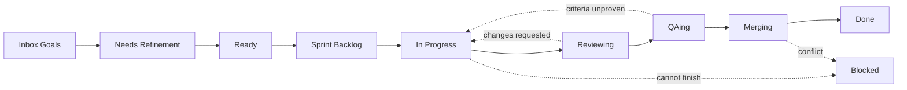

# Running the Crew

As of 2026-09-19.

An operator's guide to the crew, and an honest read on how close it is to a full agile organisation.

## What the crew is

An agile organisation run as agents, where the GitHub Projects board is the orchestrator rather than a report of one. A card's column is not a status someone updates — it is the queue a phase reads from, and moving it is how work is handed on.

Seven roles, each an agent with its own prompt, model alias and capability allow-list. One human: the Sponsor, who writes goals, approves epics, and reviews at sprint end.

| Piece | What it is |
| --- | --- |
| **Board** | GitHub Projects v2, organization-owned — a fine-grained token cannot reach a user-owned Projects board |
| **Issues and PRs** | Two GitHub Apps: one delivers, one reviews. GitHub refuses an approval from the identity that opened the pull request |
| **Model** | Qwen3.8-27B under SGLang on a DGX Spark, fronted by LiteLLM, 262,144-token window |
| **Escalation** | Headless Claude Code on a subscription — deliberately no Anthropic entry in the proxy config, so no misconfiguration can produce a metered bill |
| **Sandbox** | Generated code runs in a container with no network and no capabilities. `required` by default: no engine means the run fails rather than falling back to the host |

Two repositories are in play. `crew` is the orchestrator itself and is deliberately **not** in `delivery.repos` — an orchestrator editing itself mid-run breaks the thing making the change. `sprint-metrics` is the pilot the crew actually builds.

## The board

**Columns are queues.** A column names what a card is *waiting for*, never what is being done to it. A card sits in one for the whole of that phase's work and leaves when the phase is finished with it — so a card in QAing may be waiting for QA or being verified by it, and the board does not distinguish.



Solid arrows are the path. Dotted arrows are the ways back: a card returns to In Progress when either gate refuses it, and reaches Blocked from anywhere when only a person can move it.

| Column | Waiting for | Drained by | WIP |
| --- | --- | --- | --- |
| Inbox (Goals) | The Sponsor to approve or reject | a person | — |
| Needs Refinement | The Business Analyst to split it | refine | 8 |
| Ready | A sprint to admit it | admit | 10 |
| Sprint Backlog | A Developer to claim it | deliver | 10 |
| In Progress | The Developer to finish | deliver | 3 |
| Reviewing | The Code Reviewer to judge the diff | review | 3 |
| QAing | QA to verify behaviour against the criteria | qa | 3 |
| Merging | The merge — it is verified and approved | deliver | 3 |
| Blocked | A person | a person | — |

WIP limits are deterministic rules in `crew_org.process`, not an agent's judgement. A limit an agent can decide to ignore is not a limit.

Two human gates and no more: an epic awaiting approval in Inbox (Goals), and the sprint review at `crew sprint close`. Admission to a sprint is **not** a gate — approving the epic was the scope decision, so filling the sprint from approved epics is arithmetic.

## A tick

`crew tick` runs five phases in dependency order until a pass moves nothing. One command takes the board as far as it can go.


**Drain-first.** Work already started is pushed forward before new work is claimed, so a story never branches from a default branch missing its predecessors.

| Phase | Reads | Does | Writes |
| --- | --- | --- | --- |
| refine | Inbox (Goals), Needs Refinement | Product Owner proposes epics; Business Analyst splits approved epics into stories | new issues, cards to Inbox and Ready |
| admit | Ready | Fills the sprint from approved epics in priority order until capacity | cards to Sprint Backlog |
| review | open pull requests | Code Reviewer judges each diff | a GitHub review; cards to QAing or back to In Progress |
| qa | QAing | Verifies behaviour against each acceptance criterion | a verdict comment; cards to Merging or back to In Progress |
| deliver | Merging, then Sprint Backlog | Merges what is approved, then claims and implements the next story | merges, branches, pull requests |

**A failing phase does not end the pass.** Later phases act on the cards they can, and the failure is reported beside what did happen — a tick that aborts on the first error leaves the board partway through a state nobody chose.

**Quiescence is bounded.** Five passes maximum. A pass that keeps moving forever is a bug, not a busy board, and hitting the cap is reported as *stopped*, never as stable.

## The roles

| Role | Produces | May escalate |
| --- | --- | --- |
| Product Sponsor (human) | Goals; epic approval; sprint acceptance | — |
| Product Owner | Epics | No |
| Business Analyst | Stories, tasks, acceptance criteria, estimates | No |
| Architect | Design notes, tasks, spikes | Yes |
| Developer | Code, tests, docs, pull requests, bugs | Yes |
| QA Engineer | Behaviour verdicts, bugs | No |
| Code Reviewer | Diff verdicts, bugs | Yes |
| Scrum Master | Standups, retros, process defects | No |

Roles live in `config/agents.yaml` as data — goal, backstory, model alias, capability allow-list, and the constitution sections injected into the prompt. Changing how a role behaves is a config change reviewed like any other, not a prompt edited in passing.

**What is enforced rather than asked for.** A boundary that depends on granularity (goal vs epic vs story) or altitude (what vs how) is exactly what a small model blurs, so it is made structural:

- **Capability allow-lists.** A Product Owner *cannot* write acceptance criteria; a Business Analyst *cannot* redraw an epic.
- **Contract preservation.** `broken_contracts` refuses a public signature change that would break merged callers. Bodies and private helpers are free. The prompt asked for this first and the model did it anyway on the first attempt — a prompt is a request, this is a guarantee.
- **Whole-file rewrites.** A "new file" that already exists is refused. Deleted tests do not fail; they stop existing.
- **WIP limits and card movement.** Deterministic, in `crew_org.process`.
- **One story at a time per epic.** Siblings extend each other, so delivery holds a story until its earlier sibling has landed.

**And the counterweight.** Before adding a rule, ask whether the agent was *shown* what it needed to follow the rule it already had. Every context defect found on 2026-09-19 was prose compensating for something an agent could not see. The Developer, QA, the Reviewer, the Product Owner and the Business Analyst all now read the whole repository — the pilot is 3% of the window, the crew itself 48%.

## Running it

Start here, in this order. The first two change nothing.

```
uv run crew doctor --base-url http://<host>:8888/v1   # is the model serving, and can it call tools
uv run crew auth                                      # are both identities correctly scoped
uv run crew tick                                      # dry: refines, admits, reviews, verifies — lands nothing
uv run crew tick --land                               # the real thing
```

| Command | Changes | Notes |
| --- | --- | --- |
| `crew doctor` | nothing | Needs `--base-url` or `--host`. Checks the endpoint, chat, tool calling, constrained JSON, context length and thinking control |
| `crew auth` | nothing | Verifies the delivery identity's scope and that the reviewing identity is a different one. See the caveat below |
| `crew tick` | the board | Dry by default. Refines, admits, reviews and verifies; merges nothing, pushes nothing, opens nothing |
| `crew tick --land` | the board, GitHub | Opens pull requests and merges approved ones |
| `crew tick --demo` | nothing | Renders the live view from synthetic events. No model needed |
| `crew tick --passes N` | — | Caps the passes. Useful the first time you run `--land` |
| `crew deliver`, `review`, `qa` | as above, per phase | The individual phases, still available |
| `crew sprint start --dry-run` | nothing | Shows what would be admitted and why |
| `crew sprint close` | the board, GitHub | The sprint review. A human gate |

**What "dry" means.** Nothing is merged, pushed or opened — the line you cannot walk back. Refining, admitting and verifying still happen, because those are board state you can undo by moving a card, and a dry tick that skipped them would show nothing of what the loop does.

**Two identities.** The delivery app opens pull requests; the reviewing app judges them. GitHub refuses an approval from the identity that opened the pull request, so one app could only ever comment on the crew's own work and every story stalled waiting for a person.

> **Caveat, as of 2026-09-19.** `crew auth` reports `reviewing identity: … — can approve` on the strength of two facts: it is a different identity, and it holds `pull_requests: write`. Both are true and neither is sufficient. GitHub only counts an approval from an actor with repository write access, so the reviewing app's approvals are recorded and ignored by branch protection. Two cards are sitting in Merging because of it. Tracked as crew#40.

**The Sponsor's verbs.** Approve an epic by moving it out of Inbox (Goals). Reject it by closing it. Send a decomposition back by commenting and adding `needs:rework` — the next tick reads the comment, supersedes the old cards, and tries again.

## When it goes wrong

A failure is classified before anything is decided about it, because a mechanical mistake should not spend the budget kept for real ones.

| Class | Means | Disposition |
| --- | --- | --- |
| SCHEMA | The model's output did not validate | Retry locally with the validation error; past that, file a prompt defect |
| EDIT | An edit named a definition that does not exist | Retry locally |
| VERIFY | Lint or tests failed | Retry locally up to the limit, then escalate or block |
| REGRESSION | The change would break merged callers | Refused before a byte is written |
| SCOPE | The story was too large or its criteria ambiguous | Returned to refinement, never escalated |
| CAPABILITY | The model cannot do this | Escalates — but an unjustified claim is treated as SCOPE |

**Escalation** hands the worktree to headless Claude Code on your subscription. The budget is **one card per sprint**, and sprints are one day. That number is deliberate: at fortnightly sprints it was three, and moving to daily iterations would have multiplied the spend roughly fourteen times as a side effect of a date change.

Escalation is a release valve, never a substitute for task design. The Scrum Master reads the ledger at the retro and is forbidden from proposing a larger budget — an escalation rate above threshold is a defect in how stories were written.

**What actually needs you:**

- An epic in Inbox (Goals) — approve by moving it out, reject by closing it
- A card in Blocked — always, by construction
- A merge conflict — two changes disagree, and the crew should not decide which wins
- `crew sprint close` — the sprint review

**Reading what happened.** `var/events/*.jsonl` is the append-only record: every card move carries the acting role and the columns it moved between. Every comment the crew writes is signed with its role. `var/diffs/` keeps the rejected diff and the failure output of a card that blocked — deliberately kept, because the worktree is deleted and the evidence would go with it.

## Against a full agile suite

The flow from goal to merged code exists end to end and has run unattended. What is thin is everything that lets an organisation *learn about itself* — the feedback ceremonies, and the metrics that would make them worth holding.

| Practice | State | Where it stands |
| --- | --- | --- |
| Goal → epic decomposition | **Works** | Product Owner, gated on Sponsor approval |
| Epic → story splitting | **Works** | INVEST, Given/When/Then criteria, estimates on a fixed scale |
| Definition of Ready | **Works** | Enforced on admission |
| Sprint planning | **Works** | Mechanical from approved epics, priority order, to capacity |
| Implementation | **Works** | Sandboxed, name-addressed edits, local repair before escalation |
| Code review | **Works** | Own column, own identity, real approvals |
| Acceptance / DoD | **Works** | Criterion by criterion, refuses to judge on partial evidence |
| Merge and release | **Works** | Approval-gated, conflict-aware, ordered |
| Audit trail | **Works** | Every move and comment carries its role |
| Sprint review | **Partial** | `crew sprint close` exists; the increment is a list of merged cards |
| Retrospective | **Partial** | Scrum Master reads the escalation ledger and proposes process defects; nothing else feeds it |
| Standup | **Partial** | The role can write one; no ceremony triggers it |
| Estimation → velocity | **Partial** | Points are set and capacity is fixed at 20. Velocity is never measured, so capacity never learns |
| Backlog refinement as a ceremony | **Partial** | Happens continuously in the tick; no dedicated pass over stale cards |
| Burndown / flow metrics | **Absent** | The pilot *computes* cycle time, lead time, throughput, WIP violations — for its own repo, not for the crew |
| Dependency management | **Absent** | Sibling order only. Nothing models a dependency across epics |
| Release planning | **Absent** | No notion of a release beyond a merged pull request |
| Risk / impediment log | **Absent** | Blocked cards are the only record, and only while they are blocked |
| Self-diagnosis | **Absent** | `FILE_PROMPT_DEFECT` is decided and thrown away. crew#9 |

**The shape of the gap.** The build loop is complete; the learn loop is not. The crew can take a goal to merged code without a human touching it, and cannot yet tell you whether it is getting better or worse at doing so.

That asymmetry is not accidental — every ceremony that exists produces *work*, and every one that is thin produces *information*. The information ones were deferred because nothing was working well enough to be worth measuring. That is no longer true.

## The North Star

**An organisation that improves itself, where the Sponsor's only job is deciding what is worth building.**

Not "a crew that ships stories" — that exists. The thing worth aiming at is the loop closing on itself: the crew measures its own delivery, notices where it is failing, proposes the fix as a card, and that card goes through the same board as everything else. Every defect found on 2026-09-19 was found by a person reading code. None of them had to be.

That also reframes what scale means. If the crew runs continuously, the binding constraint becomes **goal supply** — how fast a human can decide what is worth building — and the Sponsor's role collapses to authoring goals and reading daily reviews. Which is a much smaller job than the constitution currently describes.

**The backlog, grouped by what it unlocks:**

| Unlocks | Cards |
| --- | --- |
| **The crew can see itself** — the learn loop | #9 Senior Engineer (+ its unconsumed `FILE_PROMPT_DEFECT` queue), #39 a tick that reports honestly |
| **Nothing stalls silently** | #40 an approval that cannot arrive, #32 the board's own automations |
| **It scales past a repo you can paste** | #24 let an agent fetch what it needs (deferred, and the ceiling is already 48% of the window on the crew repo) |
| **Cadence matches a 24/7 crew** | #26 a sprint that ends when its work is done |

**What I would do next, and why.** #39 before #9. The Senior Engineer's whole value is reading what the crew reports about itself, and right now a tick reports the last pass and hides every reason a card did not move. Building a diagnostician on top of a dishonest report is building it on sand.

Then #9, which is the first card that genuinely moves the North Star rather than the build loop.

**Two open questions for you:**

1. **Does the crew measure itself with its own pilot?** `sprint-metrics` computes cycle time, lead time, throughput and WIP violations — for any board. Pointing it at the crew's own board would close the metrics gap with software the crew wrote. That is either elegant or circular, and it is your call which.
2. **What is a release?** There is no notion beyond a merged pull request. If the crew is to plan beyond a single sprint, something has to say what a shippable increment is.
