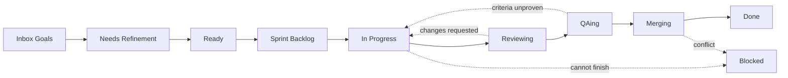
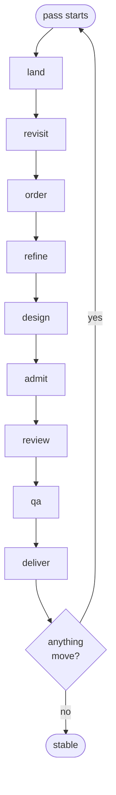

# Running the Crew

As of 2026-09-22.

An operator's guide to the crew, and an honest read on how close it is to a full agile organisation.

## What the crew is

An agile organisation run as agents, where the GitHub Projects board is the orchestrator rather than a report of one. A card's column is not a status someone updates — it is the queue a phase reads from, and moving it is how work is handed on.

Seven roles, each an agent with its own prompt, model alias and capability allow-list. One human: the Sponsor, who writes goals, approves epics, and reviews at sprint end.

| Piece | What it is |
| --- | --- |
| **Board** | GitHub Projects v2, organization-owned — a fine-grained token cannot reach a user-owned Projects board |
| **Issues and PRs** | Two GitHub Apps: one delivers, one reviews. GitHub refuses an approval from the identity that opened the pull request |
| **Model** | Qwen3.8-27B under SGLang on a DGX Spark, fronted by LiteLLM, 262,144-token window |
| **Escalation** | Headless Claude Code on a subscription — deliberately no Anthropic entry in the proxy config, so no misconfiguration can produce a metered bill |
| **Sandbox** | Generated code runs in a container with no network and no capabilities. `required` by default: no engine means the run fails rather than falling back to the host |

Three repositories are in play. `crew` is the orchestrator itself and is deliberately **not** in `delivery.repos` — an orchestrator editing itself mid-run breaks the thing making the change. `sprint-metrics` is the pilot the crew actually builds. `infra` is where things run, worked the same way as any delivery repo, with the DevOps Engineer as its domain owner (crew#349, §20).

## The board

**Columns are queues.** A column names what a card is *waiting for*, never what is being done to it. A card sits in one for the whole of that phase's work and leaves when the phase is finished with it — so a card in QAing may be waiting for QA or being verified by it, and the board does not distinguish.


```mermaid
flowchart LR
  A[Inbox Goals] --> B[Needs Refinement]
  B --> C[Ready]
  C --> D[Sprint Backlog]
  D --> E[In Progress]
  E --> F[Reviewing]
  F --> G[QAing]
  G --> H[Merging]
  H --> I[Done]
  F -. changes requested .-> E
  G -. criteria unproven .-> E
  E -. cannot finish .-> X[Blocked]
  H -. conflict .-> X
```

Solid arrows are the path. Dotted arrows are the ways back: a card returns to In Progress when either gate refuses it, and reaches Blocked from anywhere when only a person can move it.

| Column | Waiting for | Drained by | WIP |
| --- | --- | --- | --- |
| Inbox (Goals) | The Sponsor to approve or reject | a person | — |
| Needs Refinement | The Business Analyst to split it | refine | 8 |
| Ready | A sprint to admit it | admit | 16 |
| Sprint Backlog | A Developer to claim it | deliver | 16 |
| In Progress | The Developer to finish | deliver | 3 |
| Reviewing | The Code Reviewer to judge the diff | review | 3 |
| QAing | QA to verify behaviour against the criteria | qa | 3 |
| Merging | The merge — it is verified and approved | deliver | 3 |
| Blocked | A person | a person | — |

WIP limits are deterministic rules in `crew_org.process`, not an agent's judgement. A limit an agent can decide to ignore is not a limit.

Two human gates and no more: an epic awaiting approval in Inbox (Goals), and the sprint review at `crew sprint close`. Admission to a sprint is **not** a gate — approving the epic was the scope decision, so filling the sprint from approved epics is arithmetic.

## A tick

`crew tick` runs nine phases in dependency order until a pass moves nothing. One command takes the board as far as it can go. Each pass starts by landing approved work and closing finished stories and epics, so every hold after it is judged against the board as it now stands (crew#388). When an open epic has no Rank, the `order` phase has the Product Owner order the repository's open epics and name any story that must now wait for the new work (crew#358).


```mermaid
flowchart TD
  S([pass starts]) --> L[land]
  L --> RV[revisit]
  RV --> O[order]
  O --> R[refine]
  R --> DN[design]
  DN --> A[admit]
  A --> V[review]
  V --> Q[qa]
  Q --> D[deliver]
  D --> M{anything<br/>move?}
  M -- yes --> S
  M -- no --> E([stable])
```

**Drain-first.** Work already started is pushed forward before new work is claimed, so a story never branches from a default branch missing its predecessors.

| Phase | Reads | Does | Writes |
| --- | --- | --- | --- |
| revisit | the event log's rebuilds, design pull requests | Architect revisits a project's design when one sprint's stories keep colliding in the same file; the crew merges its revision; declared changes that need work become technical epics (crew#192) | a design pull request, merged; technical epics to Needs Refinement |
| refine | Inbox (Goals), Needs Refinement | Product Owner proposes epics; Business Analyst splits approved epics into stories. A project whose design is being revisited has its epics wait, except technical ones. With `refinement.panel` on in `org.yaml` (crew#440; turn it off and epics are split as before), an approved epic under a Goal is first read by the refinement panel and settled into a conclusion in its body (`crew panel`, `crew settle`); the split then reads that conclusion | new issues, cards to Inbox and Ready |
| design | epics labelled `needs:design` | Architect writes the epic's design note; Code Reviewer checks it (crew#155) | a comment on the epic |
| admit | Ready | Fills the sprint from approved epics in priority order until capacity | cards to Sprint Backlog |
| review | open pull requests | Code Reviewer judges each diff | a GitHub review; cards to QAing or back to In Progress |
| qa | QAing | Verifies behaviour against each acceptance criterion | a verdict comment; cards to Merging or back to In Progress |
| deliver | Merging, then Sprint Backlog | Merges what is approved, then claims and implements the next story | merges, branches, pull requests |

**A failing phase does not end the pass.** Later phases act on the cards they can, and the failure is reported beside what did happen — a tick that aborts on the first error leaves the board partway through a state nobody chose.

**Quiescence is bounded.** Five passes maximum. A pass that keeps moving forever is a bug, not a busy board, and hitting the cap is reported as *stopped*, never as stable.

**A pass that moved nothing still waits for the merge queue.** GitHub lands a queued PR about a minute after it joins, and a pass that ended before that landed could call the board stable while the very PR a sibling story waits for was about to merge — each tick then finished only one story of an epic (crew#314). So a pass that moves nothing, but left pull requests in the queue, polls for up to 10 minutes before the tick ends; the summary reports the wait ("waited 70s for the merge queue: 2 of 2 left it"). A PR the queue removes counts as having left it, the same as a merge.

**GitHub's rate limits are honoured, not raced against.** Every GitHub request goes through a transport that paces writes a second apart and waits out a 429, a 403 rate limit, or GraphQL's `RATE_LIMITED`, as GitHub asks (`Retry-After`, the reset time, or a minute doubling), up to three tries. Past two minutes of waiting, the tick stops cleanly where it is, rather than racing GitHub's own back-off — the next tick resumes from the board as it stands. GitHub's own budget is recorded each pass and exported as `crew_github_requests_remaining` (crew#293).

## The roles

| Role | Produces | May escalate |
| --- | --- | --- |
| Product Sponsor (human) | Goals; epic approval; sprint acceptance | — |
| Product Owner | Epics | No |
| Business Analyst | Stories, tasks, acceptance criteria, estimates | No |
| Architect | Design notes, tasks, spikes | Yes |
| Developer | Code, tests, docs, pull requests, bugs | Yes |
| QA Engineer | Behaviour verdicts, bugs | No |
| Code Reviewer | Diff verdicts, bugs | Yes |
| Scrum Master | Standups, retros, process defects | No |

Roles live in `config/agents.yaml` as data — goal, backstory, model alias, capability allow-list, and the constitution sections injected into the prompt. Changing how a role behaves is a config change reviewed like any other, not a prompt edited in passing.

**What is enforced rather than asked for.** A boundary that depends on granularity (goal vs epic vs story) or altitude (what vs how) is exactly what a small model blurs, so it is made structural:

- **Capability allow-lists.** A Product Owner *cannot* write acceptance criteria; a Business Analyst *cannot* redraw an epic.
- **Contract preservation.** `broken_contracts` refuses a public signature change that would break merged callers. Bodies and private helpers are free. The prompt asked for this first and the model did it anyway on the first attempt — a prompt is a request, this is a guarantee.
- **Whole-file rewrites.** A "new file" that already exists is refused. Deleted tests do not fail; they stop existing.
- **WIP limits and card movement.** Deterministic, in `crew_org.process`.
- **The split follows the epic's conclusion** (crew#440). When an epic has one, the Business Analyst is shown it apart from the epic's own text. A story may not contradict a row and names the rows it follows in `follows`, which its issue carries as "Follows the epic's R1, R4." Every row is followed by a story or listed in `not_for_stories` with why it isn't for stories; a split that leaves a row out is made again once with it named, and fails if it still does. The Business Analyst doesn't settle an open question: the Architect does, after the split, and its design note has to answer every one by its ID (a question left out is asked for again, and one still left out after the retries is for a person). **The criteria check reads the rows too.** Before any story exists, QA checks the split's criteria against each other and the code, and now against the conclusion: a criterion that expects the opposite of a row, or decides an open question, is a conflict. It is sent back once with the row named, and one that survives goes to the Product Owner as a story problem, as any other conflict does (crew#428). **Later steps get only the rows a story names.** The Developer, the Code Reviewer, QA and the deploy review are each shown just the rows of the epic's conclusion that the story's "Follows the epic's R1, R4" line names, under a heading with what the step does with them: build to them, judge the change against them, or hold a criterion unproven if the work rules one out. The epic's whole conclusion isn't passed down, so a long one doesn't bloat every story's context. A story that names no rows, or an epic with no conclusion, adds nothing.
- **No bare issue numbers in anything the crew posts** (crew#456). GitHub links `#123` and `GH-123` to that number in whichever repository the text lands in, and models copy numbers from their context. Every body the crew posts (issues, comments, pull requests, reviews, edits) goes through one guard in `IssueClient` first: a bare number becomes an explicit link to that issue in the repository it's posted to, and one that isn't an issue or pull request there is put in code and recorded. Code, HTML comments (the crew's markers and data), links already written and URLs are left alone.
- **One story at a time per epic, and across epics that share ground.** Siblings extend each other, so delivery holds a story until its earlier sibling has landed. Refinement is shown the project's completed stories and what their criteria delivered, so decomposing a Goal or splitting an epic doesn't propose one already built; a number that isn't a delivered story fails the split, and an epic wholly delivered closes rather than being split again (crew#220). A split is also shown the open stories other epics in the repository already hold, including ones split earlier in the same pass: one it would duplicate is named `already_delivered` the same way. An epic covered only by planned stories waits for them: it closes once they land, and is split again if one is closed without landing, since a planned story can still be superseded (crew#329). One it needs is named in `builds_on`, which delivery holds it for the same way siblings are held (crew#295). **Planning honours the same hold** (crew#353): a story is deferred, not admitted, while an earlier sibling or anything in its `builds_on` neither lands this plan nor is already on its way (Sprint Backlog through Merging), and a story an earlier sprint admitted but never started is returned to Ready, its Sprint cleared, so it plans again with its siblings instead of sitting in Sprint Backlog for good. **Technical epics are planned first** (crew#358), the way refinement already takes them ahead of a Goal's own priority order (§13, crew#192). **A story a rework supersedes, closed as "not planned,"** frees its points back to the sprint rather than spending them on work that will never be built (crew#327).

**And the counterweight.** Before adding a rule, ask whether the agent was *shown* what it needed to follow the rule it already had. Every context defect found on 2026-09-19 was prose compensating for something an agent could not see. The Developer, QA, the Reviewer, the Product Owner and the Business Analyst all now read the whole repository — the pilot is 3% of the window, the crew itself 40% (re-measured 2026-09-22).

## Running it

Start here, in this order. The first two change nothing.

```
uv run crew doctor                                    # through the proxy: is the model serving, and can it call tools
uv run crew auth                                      # are both identities correctly scoped
uv run crew tick                                      # the whole loop, and it lands what it produces
```

| Command | Changes | Notes |
| --- | --- | --- |
| `crew doctor` | nothing | Probes through the LiteLLM proxy (`CREW_LLM_BASE_URL`, with its key) as `crew-local`, the path every tick takes. Checks the endpoint, chat, tool calling, constrained JSON, context length and thinking control. `--deep` adds a CrewAI round trip |
| `crew auth` | nothing | Verifies the delivery identity's scope and that the reviewing identity is a different one. See the note below |
| `crew tick` | the board, GitHub | Refines, admits, reviews, verifies, opens pull requests and merges approved ones. Ends with a standup on the sprint's `standup` issue |
| `crew tick --demo` | nothing | Renders the live view from synthetic events. No model needed |
| `crew tick --passes N` | — | Caps the passes. Useful the first time you run it against a changed board |
| `crew deliver`, `review`, `qa` | the board, GitHub | The individual phases, still available |
| `crew sprint start --dry-run` | nothing | Shows what would be admitted and why |
| `crew sprint close [--early]` | the board, GitHub | The sprint review. A human gate. Records the retro as an issue, once per sprint. Refused while the sprint's dates run on, unless `--early`; a sprint with a retro admits nothing more (crew#193) |
| `crew sprint retro --preview [--sprint NAME] [--out FILE]` | the board, GitHub (reads only) | The retro exactly as it would be recorded, for any sprint, past or current, even one already closed. Records nothing, merges nothing, moves nothing (crew#193) |
| `crew moves [--people]` | nothing | Every card movement on the board and who made it: the crew, the platform (`board.yml`), or a person, named. Read from GitHub's own history |
| `crew decisions <repo>#<n>` | nothing | What the Sponsor has decided for a Goal, as the refinement panel and the split will be shown it (crew#440): their comments and decision log on the Goal's cards, and, in the crew's and delivery repositories, their comments naming the Goal and the body sections of their issues headed with "Sponsor" (for example `(Sponsor, 2026-09-29)`). The rest of an issue's body isn't counted, because defect reports cite Goals as evidence. Read-only. Names any repository the App can't search |
| `crew panel <repo>#<n> [--post]` | the model; GitHub (reads; one comment with `--post`) | Runs the refinement panel on an epic (crew#440): the Architect, UX Designer, QA and DevOps each read it once, in parallel, against its Goal, the project's record, the Sponsor's decisions (`crew decisions`) and its sibling epics. About five minutes. Each note says who settles it: the Product Owner, the Architect, the Sponsor or infra (the deployed runtime, which the project doesn't build, ADR 0017). DevOps is always on the panel, scoped to the runtime contract and the CI proof. Prints the notes; `--post` leaves them on the epic as one comment, once. It isn't part of a tick yet: refinement is wired to it in a later step of `docs/plans/refinement-panel-build.md` |
| `crew settle <repo>#<n> [--post]` | the model; GitHub (reads; writes with `--post`) | The Product Owner's step after the panel (crew#440). Each of the panel's notes becomes a decision row, a question left for the design note, an item for infra (the deployed runtime, listed apart, nothing waits on it), or a dismissal with its reason, in a table of ADR fields with short cells. A note no source answers, the Product Owner may decide itself, within the Goal and when it is about what the product does (ADR 0018; a design question a member marked for the Architect stays an open question): the row says it is the Product Owner's call, why, and the Goal's own words it stays within, which the code checks are in the Goal. Only when it can't tell which way the Goal points does it ask the Sponsor one question, and the epic waits for the reply. Uses the epic's panel comment, or runs the panel first. Prints the conclusion; `--post` adds it to the epic's body below the approved text (which it never changes), or posts the question. A tick runs it before an epic under a Goal is split, while `refinement.panel` is on in `org.yaml` |
| `crew revert <pr> --reason "…"` | GitHub | Opens a pull request undoing a merged one. It lands through review and `deliver` like any change |
| `crew onboard <repo> [--from <file>] [--terminal]` | GitHub | The Product Owner interviews you about a project, in a local page (or the terminal), and proposes its record, `.crew/project.yaml`, as a pull request to that project. See below |
| `crew design <repo> [--reason "…"]` | GitHub | The project's Architect proposes its `design` section (toolchain, check commands, release mechanics) as a pull request to the project, once the Code Reviewer finds no conflict with the guidelines. See below |
| `crew export <repo> [--sprint …] [--out …]` | nothing | Writes a sprint's stories and their attempts as JSON for sprint-metrics to read (crew#157). For each story: whether it landed first time, and each retry's failure class, role, cause and first error line. It also includes the causes across stories and the sprint's escalations from the ledger |

**It lands what it produces.** There is no dry mode. A rehearsal cost the same inference as the real thing, left nothing that could land, wrote no event log at all, and put cards back where it found them — which was three of the five backward moves in the crew's own log, and noise `crew capability` had to filter out of the crew's self-knowledge.

What made landing frightening was having no way to undo it. The answer is a revert (crew#83), not a rehearsal. `crew sprint start --dry-run` stays: it shows what would be admitted and costs nothing.

**What the Code Reviewer is shown.** Beside the diff (crew#160): the checks GitHub ran on the pull request's head, what delivery reported from its own sandbox run, and the project's own modules that the changed files import, as they are on the base branch. Imports are followed through re-exporting packages, up to a size limit past which whole modules are named rather than cut. A diff of tests alone no longer looks like tests that must fail when the code they exercise has already landed. It's also shown who imports the other way: for each top-level name a diff's changed files add or remove, every other file that imports it, resolved from the repository at its base branch the same way the regression guard resolves imports. An import nothing in its own file uses, that another file imports from it, is shown as passed along rather than reported as unused (crew#215).

**Epics that need design.** An epic labelled `needs:design` gets the Architect's design note, as a comment on the epic, before any of its stories is admitted (crew#155). The tick has a **design** phase between refine and admit that writes it, and the Code Reviewer checks it against the guidelines. The standup lists the stories waiting for it. If a note can't be agreed after one retry, or the Architect names a decision beyond it, the epic is blocked for you with the reason.

**Why work doesn't land first time.** Every retry is recorded with its failure class and what went wrong (crew#157). A failure becomes a *cause* by keeping the rule and masking the names, paths and numbers, so the same mistake counts the same wherever it happens. At sprint close the retro is shown the first-try rate and the causes. A cause seen on two or more of the sprint's cards is filed as a crew defect, with its count and cards, unless one is still open for it. A recurring parse failure is filed as a prompt or schema defect. Two kinds of cause are counted but never filed as recurring: a test's own assertion failing, because that's the card's wrong answer, and a failure whose cause wasn't recorded. A cause a fix solved during the sprint isn't filed again, if every occurrence came before the fix (crew#199). The fix is a retro finding for that cause closed as completed, or a merged crew pull request whose body carries the cause's marker, `<!-- crew:cause:KEY -->`. The retro prints each cause's key. Only occurrences after a fix count as evidence it recurs. `crew export` writes the same data for sprint-metrics.

**The retro's layout.** The sprint-close retro issue is laid out by the crew, around the Scrum Master's words (crew#176). It has these sections:
- **Delivered:** a sentence, plus a table of the sprint's stories and points built from the board.
- **How it went:** at most six bullets.
- **Why work didn't land first time:** the first-try rate and causes.
- **Needs you:** blocked cards past the threshold, the approval queue as a count and range, and anything else raised for you. It says "Nothing." when there's nothing.
- **Defects filed.**

A filed defect's title is a short statement of the problem, under 80 characters. The retro is also shown the crew issues **fixed during the sprint** (crew#174), counted from when the sprint's standup issue opened. It cites those instead of filing them again.

**Work sent back.** When the Code Reviewer requests changes, the story is reworked on its own branch: brought up to date with `main`, then the findings are answered on top of the previous attempt, and the same pull request is updated. If other work has merged into the same lines in the meantime, so the branch conflicts with `main`, the story is rebuilt on current `main` instead of blocked (crew#158). It's being rewritten anyway. The Developer is told why and shown the findings, the branch is replaced (force-with-lease, so only the crew's own refused attempt is overwritten), and the PR gets a comment naming the conflicting paths. If the findings are already met by the code as it stands (another story may have landed the work first), the Developer can answer with evidence for each finding instead of inventing a change (crew#161). The checks run on the branch as it is, and the answer is committed empty so the PR's head moves. The evidence is posted on the PR, and the Code Reviewer is shown it when it reviews again. A second answer of that kind on the same PR goes to a person, with both the review and the answer quoted, rather than looping. An **approved** PR that conflicts with `main` at merge first has both sides kept, where each only added lines at the same place (crew#436): its own changes are as approved, and CI runs again on the new head. Otherwise it is rebuilt the same way (decided 2026-09-25), and the rebuild's comment and event name the conflicting files and the commit that landed in them first. The rebuild waits to start while another story's open pull request still changes those files, so it doesn't conflict again the moment that one lands. A pull request that is itself waiting on a rebuild, or whose story is blocked, holds nothing. sprint-metrics is one module, and parallel epics touch it together, so this is routine rather than rare. The rebuild costs model time, not a person, and the rebuilt PR goes through review and QA again, so nothing lands unreviewed. After two rebuilds of the same PR it goes to a person instead of looping. A revert that conflicts still blocks for a person.

**Landing through the merge queue.** Where a repository's `main` has a GitHub merge queue, an approved PR joins the queue instead of being merged by the crew (crew#302). GitHub tests each PR on top of the ones ahead of it and merges them in the order they joined. Without the queue, every merge left the other approved PRs behind `main`: they were brought up to date, and the next merge put them behind again. The card stays in Merging while its PR is queued, and moves to Done once GitHub has merged it, often by the board's own automation before the crew looks again. So the event log records a PR joining the queue, and the board records when it merged (crew#302). **The crew closes what it merged, rather than trusting GitHub's own `Closes #N` keyword** (crew#381): sprint-metrics#339's pull request carried the keyword, GitHub never linked it, and the card reached Done with its issue still open. Each pass, a Done story whose issue is open and whose pull request merged is closed. An epic is read as finished from its children on the board — one that isn't Done holds it — and GitHub's own sub-issue count is only the fallback for a parent with none on the board, because that count can be wrong: it read one of two for an epic whose two children were both closed and Done, and held everything waiting on it. A PR the queue removes for a conflict is rebuilt like any approved PR that conflicts. **A red CI check goes back to the Developer with its log** (crew#325). That covers a check that failed on the PR's head, which can't join the queue, and a check that failed on the queue's merge group. The crew's own checks run lint and tests in a sandbox with no network, so what only CI runs, such as an image build or a release workflow, is proven nowhere else. The failing step of the job's log goes on the PR, marked with the head it judged, and the card goes back to In Progress. The next delivery reads it with the review and QA verdicts and works on the same branch. QA is shown the checks on the commit it judges, so a criterion only CI can run is proven by naming the passing check that runs it. A check proves only what its steps execute: sprint-metrics#260's QA cited `tests`, which never runs `release.yml`, as proof of the release workflow's behaviour. **A workflow that fails on a default branch after merge becomes a technical epic** (crew#335, the first DevOps duty). At the start of each tick's revisit phase, the latest push run of each workflow on each delivery repo's default branch is read. One that failed gets a technical epic, one per workflow while it's open, carrying the failing step's log. It skips your gate and holds that project's product epics until it lands, like any technical epic (crew#192): a red `main` stops the line. If the workflow passes again before any work started on the epic, the watcher closes it. **A release is checked for what it actually published** (crew#335). Once the release workflow's run for the default branch's head has finished and the version isn't `0.0.0`, the check reads GitHub and GHCR: the tag, a GitHub Release whose notes carry the version's CHANGELOG entries, and the image for amd64 and arm64. It also checks that `X.Y` and `latest` point at the same image, that a GitHub artifact attestation exists for its digest, and that the image carries its `org.opencontainers.image.source` label. A missing tag is one gap, not three — without it there's no Release and no `CHANGELOG.md` to read at it either, so those aren't listed as separate misses (crew#384). Any gap becomes a technical epic, one per version, titled "was never published" when the tag doesn't exist and "published less than the design asks" when it does, because a green release run can still have published less than the design asks. **Except one.** The registry is read anonymously, and a package GHCR reports as private or missing is a setting only its owner can change, on the package's own settings page — no API or workflow token reaches it, so no story could act on it (crew#386). That gap alone files no epic: the tick reports it as waiting on you, and the check looks again next tick. Found alongside real crew work, it's still named on the epic, apart from what the crew can do. Job logs are read with the crew's own token. That works for a public repository; a private one needs the App's Actions: Read-only permission. Without a merge queue, the crew merges directly as before, and brings a PR that is behind `main` up to date first. Either way, a PR whose mergeability GitHub is still working out is read again before anything is tried, rather than merged blind.

**Undoing a change.** `crew revert <pr> --reason "…"` opens a pull request on a `revert/<pr>-…` branch. It is reviewed like any other change, and the deliver phase merges it once approved. When it lands, whoever merged it, the card whose work it undid is reopened and returned to Needs Refinement with `needs:human`, because the work is not done. A revert that does not apply cleanly is never forced: the card is blocked with the conflicting paths named. Each step is a `revert.*` event recording the pull request reverted, its card and the reason.

**Two identities.** The delivery app opens pull requests; the reviewing app judges them. GitHub refuses an approval from the identity that opened the pull request, so one app could only ever comment on the crew's own work and every story stalled waiting for a person.

> **Resolved, verified 2026-09-22.** The reviewing app's approvals count, and
> the crew merges its own work end to end. sprint-metrics PR #66 was approved by
> `mqucifer-crew-approver[bot]`, GitHub recorded `reviewDecision: APPROVED`, and
> it merged during the Sprint 3 run.
>
> This is written from the live answer rather than from a card. An earlier
> version of this page said the permission was still an open Sponsor decision;
> it was reading crew#40's issue body, which described 2026-09-19 and was never
> updated when the access changed. The issue text outlived the fact.
>
> crew#40's code still earns its place: `crew auth` states what it verified
> instead of concluding what it has not tested, and a pull request GitHub
> reports as `REVIEW_REQUIRED` despite an approving review is blocked and
> labelled for a person rather than waiting forever. That is now a guard
> against a regression instead of a description of the present.

**Onboarding a project.** `crew onboard <repo>` is an interview in a local page, which it opens in your browser: the conversation with a field for each question, and the record building beside it. The page is served on 127.0.0.1 only and every request carries a token from its URL. Ctrl-C in the terminal ends it and keeps the answers. `--terminal` runs the same interview at the prompt instead. If the project has content, the Product Owner reads it (README, code, CI workflows, branch protection) and proposes answers for you to confirm or correct. If it has none, it asks. It is shown the project's open issues as well as its code, and tests your answers against both: it keeps asking while an answer is missing, vague, or at odds with the project. You can answer, tell it an answer is fine as it is, or reply `done` to go straight to the record (a missing required answer still has to be given). On your yes it opens a pull request adding `.crew/project.yaml` to the project, with the interview folded into its description. Every session's transcript is also kept in `var/onboarding/<repo>.transcript.md`. Answer `later`, or end the session, and the answers so far go to `var/onboarding/<repo>.yaml`, with each unanswered one commented out under its question. What the Product Owner *proposes* is kept apart from what you've answered (crew#148): the page shows proposals under the record, marked as not yet confirmed, and the take-away file has them commented out beside their fields. A proposal becomes part of the record only once you confirm it. Finish it in any editor, then `crew onboard <repo> --from <file>` asks only about what is still missing. Every question still open when a session ends is kept (crew#181), optional ones too. Each goes in the take-away file under its field, or under "Still open" at the top when it isn't about one field, and in `var/onboarding/<repo>.open.json`. The next session shows them to the Product Owner, even on a complete record, until they're answered. The record's pull request carries every session since the record was last proposed, with the questions still open listed on their own. A repository with no commits has no branch to propose against, so the finished record is kept in that file until it has one. Each turn is one model call, several minutes long on crew-local.

**What the record holds, and whose it is.** Three sections with three owners (crew#143). `intent` is yours, from the interview: what the project is for and its edges, what counts as a release, the bar for done in words, what agents must not touch, and any guidelines this project adds to the crew-wide ones in the constitution's §19. A project can add to those, never relax one. The Product Owner flags any guideline that would, and the record isn't offered until that's resolved. `design` is the project's Architect's (crew#144): language, build, sandbox needs, the commands that enforce done, what only CI proves (`ci_checks`, in words: an image built and run as deployed isn't a command the sandbox can run, crew#335), and how a release happens. For a project that isn't Python it also names the image its checks run in, pinned by digest, with the setup and autofix commands (crew#403), and its **parts**: each directory's language and test files. A part decides the Developer's tools there. Python gets edits by definition name and the guard; any other language gets whole-file and find-and-replace edits, with its tests found by title (ways of working §14, crew#404). The interview never asks you to pick a tool, and has nowhere to record one. `learned` is the crew's (crew#112). Required: the purpose, what a release is (a deployment, a published version such as a tag users install, or the merge; and where, for the first two), and the bar for done in words. A published version is its own kind of release, not a deployment (crew#141). A phase that needs check commands and finds no `design` says none are defined, rather than guessing. `crew design <repo>` fills `design` once the project is onboarded (crew#144). The Architect proposes each choice with what it's based on. Where the project already has an answer in its CI, lockfile or build, the Architect records it, and anything it would do differently it states as a change, with why. Any practice the design introduces that the project doesn't already follow is refused unless it's declared as a change, not only a check command — sprint-metrics' first design once added "the version in pyproject.toml is updated to match the tag" under "Changes: None" (crew#154). The Code Reviewer, not the Architect, checks the proposal against §19 and the project's guidelines. A conflict gets one retry, then a refusal naming the guideline, and no pull request. Revisiting a design takes `--reason`, and delivery can never change it: the record is protected (crew#131). The crew also revisits a design itself, without asking you, when one sprint's stories keep being rebuilt over the same file (crew#192, constitution §13). It merges that revision itself, and turns each change that needs code into a `technical` epic that skips your gate. The standup's **Decided by the crew** section tells you what changed and why. Changes declared in a `crew design` pull request you merge become technical epics the same way. A design that leaves the record as it was opens no pull request: with no declared work it says so, and work it declares is filed as technical epics directly, since the record already says it (crew#335). **A repository in `delivery.repos` without a usable record isn't worked** (crew#132). This is a precondition, not a gate: adding a repo to `delivery.repos` is already your decision. At the start of each tick, a repo with no record, or one missing a required answer, is left alone. The terminal and the standup's **Not worked: not onboarded** section say which repo and what's missing. Once it's onboarded, the next tick works it. Once a project has a record, refinement, delivery and QA are all shown it ahead of the code, and delivery refuses, before writing anything, changes to never-touch paths, to the record itself, or to CI that would stop a design check being enforced (crew#131).

**The Sponsor's verbs.** Approve an epic by moving it out of Inbox (Goals). Reject it by closing it. Send a decomposition back by commenting and adding `needs:rework` — the next tick reads the comment, supersedes the old cards, and tries again.

**Whose comments the crew reads.** The repositories are public, so anyone can comment, and a comment read as direction carries real authority — it steers a re-split, or answers the Product Owner's question. Only a comment from your own login counts as that (crew#399, `org.yaml`'s `trust.sponsor`). Only a comment from one of the crew's own identities counts as the crew's own record; a comment merely carrying one of the crew's markers in its text no longer does. Anyone else's comment is ignored, and noted in the event log with who wrote it and on which card, so a real contributor isn't silently dropped — if outside input is ever wanted, adopt it by replying yourself.

## When it goes wrong

A failure is classified before anything is decided about it, because a mechanical mistake should not spend the budget kept for real ones.

| Class | Means | Disposition |
| --- | --- | --- |
| SCHEMA | The model's output did not validate | Retry locally with the validation error; past that, file a prompt defect |
| EDIT | An edit named a definition that does not exist | Retry locally |
| VERIFY | Lint or tests failed | Retry locally up to the limit, then escalate or block |
| REGRESSION | The change would break merged callers | Refused before a byte is written |
| SCOPE | The story was too large or its criteria ambiguous | Returned to refinement, never escalated |
| CAPABILITY | The model cannot do this | Escalates — but an unjustified claim is treated as SCOPE |

**A dead model backend is never blamed on a card.** Any command, pre-flight or mid-run, that finds the backend unreachable says which side is down in one line and exits, rather than a traceback from inside a model client and a failure charged to whatever card was in flight (crew#168).

**Escalation** hands the worktree to headless Claude Code on your subscription. The budget is **one card per sprint**, and sprints are one day. That number is deliberate: at fortnightly sprints it was three, and moving to daily iterations would have multiplied the spend roughly fourteen times as a side effect of a date change.

Escalation is a release valve, never a substitute for task design. The Scrum Master reads the ledger at the retro and is forbidden from proposing a larger budget — an escalation rate above threshold is a defect in how stories were written.

**What actually needs you:**

- An epic in Inbox (Goals) — approve by moving it out, reject by closing it
- A card in Blocked — always, by construction
- A merge conflict — two changes disagree, and the crew should not decide which wins
- A card returned by a revert — decide whether to re-scope it, re-deliver it, or close it
- `crew sprint close` — the sprint review
- The sprint's `retro` issue on the crew repository — read it, triage the `retro-finding` issues it filed, and close it

**Reading what happened.** `var/events/*.jsonl` is the append-only record: every card move carries the acting role and the columns it moved between. Every comment the crew writes is signed with its role. `var/diffs/` keeps the rejected diff and the failure output of a card that blocked — deliberately kept, because the worktree is deleted and the evidence would go with it.

## Against a full agile suite

The flow from goal to merged code exists end to end and has run unattended. What is thin is everything that lets an organisation *learn about itself* — the feedback ceremonies, and the metrics that would make them worth holding.

| Practice | State | Where it stands |
| --- | --- | --- |
| Goal → epic decomposition | **Works** | Product Owner, gated on Sponsor approval |
| Epic → story splitting | **Works** | INVEST, Given/When/Then criteria, estimates on a fixed scale |
| Definition of Ready | **Works** | Enforced on admission |
| Sprint planning | **Works** | Mechanical from approved epics, priority order, to capacity |
| Implementation | **Works** | Sandboxed, name-addressed edits, local repair before escalation |
| Code review | **Works** | Own column, own identity, real approvals |
| Acceptance / DoD | **Works** | Criterion by criterion, refuses to judge on partial evidence |
| Merge and release | **Works** | Approval-gated, conflict-aware, ordered |
| Audit trail | **Works** | Every move and comment carries its role |
| Sprint review | **Partial** | `crew sprint close` exists; the increment is a list of merged cards |
| Retrospective | **Works** | Recorded at sprint close as a `retro` issue on the crew repository, each defect filed where the thing it found lives (#50). Reads the board, the escalation ledger and the sprint's standups (#79) |
| Standup | **Works** | Every `crew tick` ends with one, written mechanically from what the tick did, as a comment on the sprint's `standup` issue. The retro reads them (#79) |
| Estimation → velocity | **Partial** | Points are set and capacity is fixed at 40 (doubled from 20 on 2026-09-26, after Sprint 7 delivered its 20 in an afternoon of ticks). Velocity is never measured, so capacity never learns |
| Backlog refinement as a ceremony | **Partial** | Happens continuously in the tick; no dedicated pass over stale cards |
| Burndown / flow metrics | **Partial** | `crew capability` measures time in each column, what was exercised, rework, and interventions counted from the board's history (#42, #89). No burndown |
| Dependency management | **Absent** | Sibling order only. Nothing models a dependency across epics |
| Release planning | **Absent** | No notion of a release beyond a merged pull request |
| Risk / impediment log | **Absent** | Blocked cards are the only record, and only while they are blocked |
| Self-diagnosis | **Absent** | `FILE_PROMPT_DEFECT` is decided and thrown away. crew#9 |

**The shape of the gap.** The build loop is complete; the learn loop is not. The crew can take a goal to merged code without a human touching it, and cannot yet tell you whether it is getting better or worse at doing so.

That asymmetry is not accidental — every ceremony that exists produces *work*, and every one that is thin produces *information*. The information ones were deferred because nothing was working well enough to be worth measuring. That is no longer true.

## The North Star

**An organisation that improves itself, where the Sponsor's only job is deciding what is worth building.**

Not "a crew that ships stories" — that exists. The thing worth aiming at is the loop closing on itself: the crew measures its own delivery, notices where it is failing, proposes the fix as a card, and that card goes through the same board as everything else. Every defect found on 2026-09-19 was found by a person reading code. None of them had to be.

That also reframes what scale means. If the crew runs continuously, the binding constraint becomes **goal supply** — how fast a human can decide what is worth building — and the Sponsor's role collapses to authoring goals and reading daily reviews. Which is a much smaller job than the constitution currently describes.

**The backlog, grouped by what it unlocks:**

| Unlocks | Cards |
| --- | --- |
| **The crew can see itself** — the learn loop | #56 what is measured reaches somebody, #42 measure what the crew *can do*, #9 Senior Engineer (+ its unconsumed `FILE_PROMPT_DEFECT` queue), #50 the retro goes somewhere |
| **It scales past a repo you can paste** | #24 let an agent fetch what it needs (deferred, and the ceiling is already 48% of the window on the crew repo) |
| **Cadence matches a 24/7 crew** | #26 a sprint that ends when its work is done |
| **The Sponsor can watch it** | #4 the observability goal, and #5, #16, #17, #18 under it — all `needs:human` |

**What was cleared first, and why.** #39 — a tick that reports honestly — before anything that reads what the crew says about itself, because building a diagnostician on a dishonest report is building it on sand. Then, on 2026-09-22, seven cards closing the loop's ways of getting permanently stuck: #40, #45, #49, #63, #64, #67 and #69. A story that was refused, unapprovable, or refused again now has a path forward instead of a corner. None of that moved the North Star; all of it stopped the build loop eating the attention the North Star needs. On 2026-09-23 the "nothing stalls silently" row went the same way: #32 (the board moves the cards no role moves), #44 (a story held for room is let in when it drains) and #46 (a story with no epic can enter a sprint).

**What is next, and why in this order.** #56, then #42, then #9 — the order the cards themselves argue for.

- **#56** is the cheapest by a distance: `aging_blocked()`, `over_limit()` and `bridge_crewai()` are all written and **nothing calls them**. Its third criterion puts model calls, tokens and tool use into the event log, which is most of what #42 needs about cost.
- **#42** then measures what the crew *can do* rather than what it worked on. The data mostly exists — 48 of 58 `card.moved` events already carry the from-column, the to-column, a timestamp and the role.
- **#9** last, because a Senior Engineer needs #42 to diagnose *from*. It is the first card that genuinely moves the North Star rather than the build loop.

**Which model backs the Senior Engineer** was the open question inside #9, and it is settled: **the local model.** It has not been the bottleneck — every failure so far has been the agent not being shown what it needed, not the agent being unable to reason about what it saw. That is §16's argument, and three of those seven cards were exactly it — #63, #64 and #67 were all a role failing on what it could not see, or on a budget spent before it could answer. Escalation stays for genuinely hard problems, which is the one thing it must not stop being.

**Does the crew measure itself with its own pilot? — answered: no.** `sprint-metrics` computes cycle time, lead time, throughput and WIP violations for any board, and pointing it at the crew's own board would close the metrics gap with software the crew wrote. It was posed here as either elegant or circular. #42 settled it, with the reason:

> the crew practises on that repository, so a bad delivery would break the crew's self-knowledge precisely when it is most needed. Keep the dependency one-directional: the crew computes, and the pilot may present.

Section 18 *allows* the pilot to become a tool the crew calls. It does not require the crew to depend on it, and the crew's ability to see itself is the wrong thing to make depend on the crew's own practice work.

**Still open — what is a release?** There is no notion beyond a merged pull request. If the crew is to plan beyond a single sprint, something has to say what a shippable increment is. This gates release planning rather than the learn loop, so it is not urgent yet.

## The board's own automations

Card movements **no role performs** — a person closing an issue, a pull request
merged by hand, an item arriving on the board — are handled by
`.github/workflows/board.yml` in each delivery repository, not by the board's
built-in workflows. The crew repository has none: its issues are not on the
board.

| Trigger | Sets Status to |
| --- | --- |
| an issue opened (and auto-added) | `Needs Refinement` |
| an issue or pull request closed | `Done` |
| run by hand (`workflow_dispatch`) | sweeps every closed card that is not in `Done` |

**Why a file and not the board's own settings.** The GraphQL API exposes
`enabled` on a `ProjectV2Workflow` and nothing else — no trigger, no target,
and no mutation to create or configure one. A built-in workflow is therefore
unreadable after the fact, unreviewable before it, and gives no way to tell
whether it still points at a Status option that exists. It also cannot sweep:
enabling one fixes the future and leaves every card already in the wrong
column.

**The built-ins stay off.** Two mechanisms moving the same cards is worse than
either alone, and only one of them can be read.

**The line this holds.** Transitions a *role* performs stay in crew code,
because those carry an acting role and emit a `card.moved` event that the audit
trail and `crew capability` both read. That is why "Pull request linked to
issue" is deliberately not automated: the Developer makes that move and should
be recorded making it.

**It needs a credential.** Actions' automatic `GITHUB_TOKEN` is
repository-scoped, and its `repository-projects` permission covers classic repo
projects rather than organization Projects v2 — so it cannot write this board at
all. The workflow mints a short-lived token from the crew's own App, which
already holds project write, from the App's public Client ID (in the workflow's
`env`) and the `BOARD_APP_PRIVATE_KEY` secret.

**What it does not catch.** Reopening an issue moves nothing, so a card can sit
in `Done` with its issue open. `crew capability` reports both that and any
closed card outside `Done` before it prints anything else, because a column
holding finished work reports a queue that is not a queue.

**Telemetry, for Grafana (crew#283).** Every event the crew records is also written to `var/telemetry/*.jsonl`, reduced to an allow-list of attributes: time, kind, role, card, repo, sprint, attempt, what it was for, column moves, model alias, tokens, duration, finish reason, failure class and outcomes. It never carries a prompt, a response, test output, an error message or any other free text; those stay in `var/events`, which is the crew's own record. `crew telemetry --backfill` rebuilds the telemetry log from the whole event history. Run it before anything starts tailing the log, since it rewrites the files. `deploy/telemetry` runs a small exporter container (Python standard library only, read-only, non-root, no capabilities) that serves Prometheus metrics computed from that log at `:9464/metrics`: events, card moves, model calls, tokens and seconds by role and model, retries by failure class and disposition, GitHub requests remaining, ticks, cards per column, and when the crew last did anything. There are no per-card labels. The crew ships nothing anywhere. An OpenTelemetry Collector in the same stack (`crew-otelcol`, owned by the Sponsor) reads the telemetry log, scrapes the exporter and LiteLLM's metrics (with identity labels dropped), and sends them to Grafana Cloud. Its endpoint and `Authorization` header come from the repository-root `.env` as `GRAFANA_OTLP_ENDPOINT` and `GRAFANA_OTLP_AUTH` (`Basic <base64>`, as Grafana's OpenTelemetry page gives it, with `%20` as a space). They deliberately don't use the standard `OTEL_EXPORTER_OTLP_*` names: every OpenTelemetry SDK reads those, and would send straight to Grafana, around the collector and its content filter. Start it with `docker compose --env-file ../../.env up -d` from `deploy/telemetry`. CrewAI's own anonymous telemetry, on by default, is turned off as `crew_org` loads, before anything imports CrewAI: nothing about the crew's work reaches a third party outside this pipeline.

**Stack health (crew#335).** Each tick starts by checking the stack it runs on. The proxy and model are required: if they don't answer, the tick stops, as before. The telemetry exporter (`:9464/metrics`) and collector (`:13133`, its health endpoint) are not required: when either is down the tick prints a warning and carries on, and the standup gains a **Stack health** section that names each component that isn't answering and how to start it. A healthy stack adds nothing to the standup. Without this, a stopped collector was visible only as an empty dashboard. The same start-of-tick check also confirms the board's Owner Agent field has an option for every role in `agents.yaml`; a missing one is named there rather than surfacing later as a review pass that "failed" partway through (crew#335). A role the board has no option for no longer breaks the move that hit it: the card still moves and its event is still written, and only the missing attribution is noted.

**Traces, alongside the metrics and logs.** A tick is a trace; each phase, each card worked within it, and each model call are spans beneath it, shipped with the OpenTelemetry SDK to the same collector, which forwards them to Grafana Tempo. The standard `httpx` instrumentation adds a span per outbound call and carries `traceparent` to LiteLLM, so its own spans nest underneath. Spans carry the same kind of attributes as the telemetry log — card, repo, sprint, attempt, role, model alias, tokens, duration, finish reason — and never a prompt, response or other free text; the collector's `transform/no-content` drops content-named attributes as a second lock. The endpoint is `telemetry.otlp_endpoint` in `org.yaml`, passed to the exporter directly rather than through `OTEL_EXPORTER_OTLP_*`. Unset, nothing is exported and tracing costs nothing; a collector that's down loses spans without slowing a tick.
