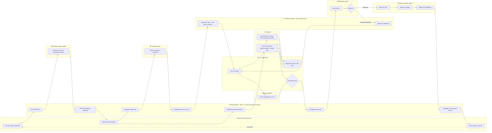

# CrewAI Agile Workflow — Final State

> **Work in progress, and not the constitution.** This describes a
> fully-staffed target state, not what the crew does today.
> [`ways-of-working.md`](ways-of-working.md) is what agents follow and wins
> every conflict; [`running-the-crew.md`](running-the-crew.md) is what exists
> now. Where this document and those two disagree, the disagreement is the
> point — it is what the target adds.
>
> Two differences to hold in mind while reading. It names the human **Product
> Owner**, where the constitution names the human the **Product Sponsor** and
> gives *Product Owner* to an agent. And it orchestrates through a **Manager
> Agent** under CrewAI's hierarchical process, where the crew today
> orchestrates through the board — a card's column is the queue a phase reads
> from. Neither is reconciled yet.

## Context

- **Harness:** CrewAI, hierarchical process
- **Orchestration:** Manager Agent role backed by Claude Opus 5
- **Worker agent inference:** local Qwen3 model served via SGLang
- **Team roles:** Product Owner (human), Manager Agent, Business Analyst Agent,
  Architect Agent, Developer Agents (pool), QA Agent, Security Agent, Reviewer
  Agent, Release/DevOps Agent
- **Repos:** the crew itself lives in its own repo; agents operate against
  separate target repos

This describes the fully-staffed final state, not the current 4-agent build
(Planner, Architect, Developer, Reviewer).

## Workflow diagram

## Swim lane walkthrough

### 1. Sprint planning

1. **Product Owner** sets the sprint goal and priorities — the one strategic
   human input.
2. **Manager Agent** kicks off a task for the **BA Agent** to elaborate
   priorities into stories with acceptance criteria.
3. **BA Agent** returns refined, estimable stories as task output.
4. **Manager Agent** batches these into a proposed sprint backlog and surfaces
   it once.
5. **Product Owner** approves the backlog in one pass (**PO2**) — this is the
   trigger point for everything downstream.

### 2. Design & build track (parallel to QA track, starts at PO2)

6. **Manager Agent** delegates a design task to the **Architect Agent** per
   story (skippable for trivial stories).
7. **Manager Agent** assigns the resulting design as a task to an available
   **Developer Agent** in the pool — CrewAI runs multiple developer tasks
   concurrently.
8. **Developer Agent** implements on a branch in the target repo, generating
   code via local Qwen3 over SGLang, and writes unit tests colocated with the
   code — narrow, story-specific, thrown away/rewritten if the implementation
   changes.
9. **CI** runs lint and unit tests as first-pass feedback.

### 3. QA track (shift-left, parallel to design/build)

This is the key change from the original draft.

- **6b.** **Manager Agent** delegates a test-planning task (**M3b**) the moment
  the sprint backlog is approved (**PO2**) — in parallel with the design task,
  not after code exists.
- **7b.** **QA Agent (Q0)** turns the BA's acceptance criteria directly into a
  test plan and initial test cases (spec-first / BDD-style), before any code
  exists. It writes these into the persistent **Regression Suite**.
- **8b.** Once the Developer's branch reaches CI, **QA Agent (Q1)** pulls the
  existing regression suite, runs it against the real implementation, and
  extends the suite with anything the implementation reveals. The suite
  persists in the target repo regardless of whether this particular PR merges —
  it's the net that catches regressions across stories, not just this one.

**Why gate QA's track on PO2 rather than BA1.** Acceptance criteria technically
exist the moment BA1 finishes, but the story isn't committed to the sprint
until the PO approves it. Starting test-planning at BA1 risks burning agent
cycles (and inference) on a test plan for a story that gets rejected or
reworked during backlog approval.

### 4. Quality gates (parallel)

10. On a CI pass, **QA Agent** and **Security Agent** run concurrently
    (`async_execution=True` on both CrewAI tasks) — integration/regression
    tests and SAST/dependency scanning respectively.
11. Either failure routes back to the **Developer Agent** as a new task with a
    structured summary of what failed and why — not raw logs — without
    involving the Manager or a human.

### 5. Review & release

12. **Manager Agent** delegates a review task to the **Reviewer Agent**.
13. **Reviewer** either requests changes (task re-delegated to the Developer
    Agent, re-entering CI) or approves.
14. On approval, the **Release/DevOps Agent** merges to main, deploys to
    staging, and promotes to production.
15. **Manager Agent** aggregates task outputs into cycle-time and defect
    metrics for the sprint.
16. **Product Owner** reviews outcomes and signs off, closing the loop into the
    next sprint's planning.

## Key decisions & rationale

- **QA stays a dedicated agent**, not folded into the Product Owner's human
  step.
- **Test ownership split:** Developer Agent owns unit tests (colocated,
  story-specific); QA Agent owns the integration/regression suite (persistent,
  survives any single PR's outcome).
- **QA's test-planning task fires on PO2** (backlog approval), not on BA1
  completion — avoids wasted work on stories that don't make the sprint.
- **Test execution sandbox:** CrewAI's built-in `CodeInterpreterTool` has been
  deprecated; CrewAI's current docs recommend a dedicated sandbox service (E2B
  or Modal). Given this is a local-first setup (Qwen3/SGLang running on your own
  machine), a **self-hosted Docker container per branch/story** is the better
  fit than an external cloud sandbox — no code leaves the network, no per-run
  API cost.
- **Isolation granularity:** one ephemeral container per branch/story, not a
  shared environment — required because Developer Agents run multiple stories in
  parallel.
- **Sandbox parity with CI:** build the test-bed container from the same base
  image your real CI pipeline uses, to avoid "passed for the agent, failed in
  CI" drift.
- **Docker image strategy:** a single shared base image (Python + pytest +
  common tooling) across all target repos for now, given single-developer scale.
  Only branch into a repo-specific Dockerfile the day a repo needs something the
  base image can't provide (different Python version, system dependency, etc.).
